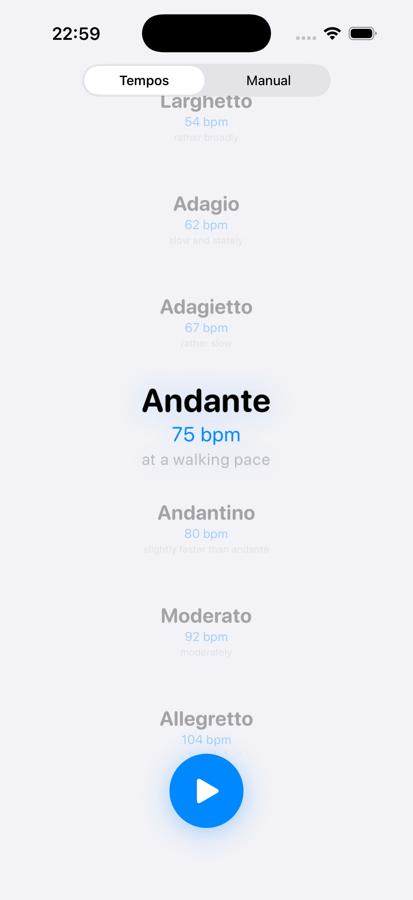
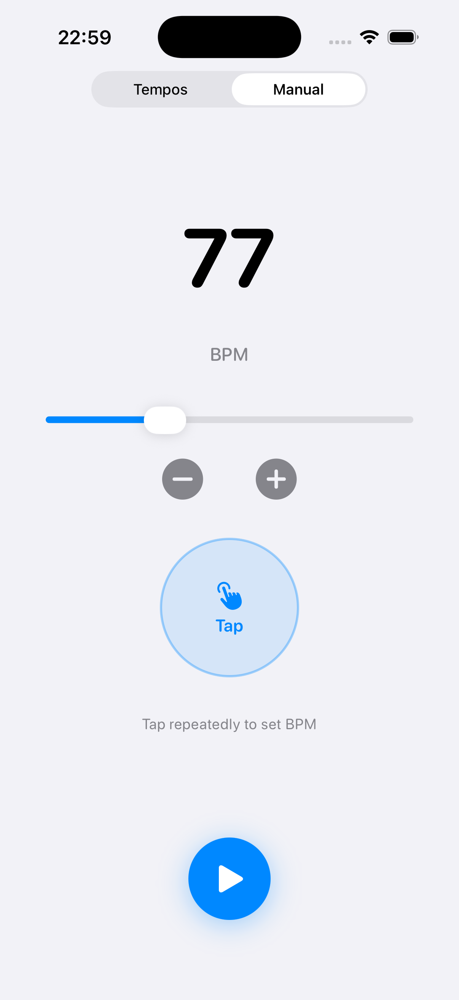
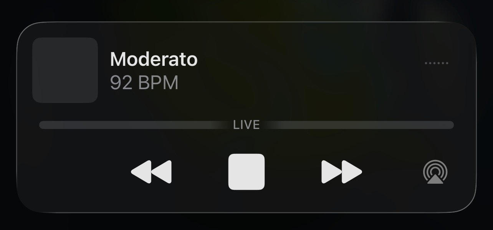

# 🥁 Metronome

A clean, delightful iOS metronome built with SwiftUI. Features a gorgeous tempo picker, tap-in tempo detection, a beat-synced pulsing play button, and full lock screen control.

Requires iOS 17.0+.

## Screenshots

<p align="center">
  
  
</p>

<p align="center">
  
</p>

# Contribution guide

Word of caution - this whole app is vibe-coded — I never looked at the code, I debugged and fixed issues by copy-paste from XCode to the agent. And yet it is the best metronome app for iOS so far. Living on a vibe. Catching the groove. Surfing the hype. I tested on my phone and it kind of worked. But I've got no idea if that works on others. PRs aren't very welcome simply because I think this masterpiece is done, nothing more can be added. But you can try regardless. And yes, I know pulsing button goes out of sync with the BPM. At least the metronome plays at the right tempo. Most of the time, at least.

## Features

### 🎵 Tempo Picker

Browse 15 Italian tempos — from Larghissimo (20 BPM) to Prestissimo (208 BPM) — in a snap-scrolling carousel. The selected tempo **scales up, glows, and pops** while surrounding tempos fade into the background, making it easy to see your pick at a glance.

### 🔢 Manual Mode

Slide to any BPM between 20–208, or tap the ± buttons for fine adjustment. The slider range is aligned to the tempo list so both modes stay in sync.

### 👆 Tap-In Tempo

Switch to Manual and tap the big circle. After just a couple of taps the app detects your tempo and sets the BPM automatically. The metronome starts playing after three taps so you can keep your hands free (or on your instrument).

### 💓 Pulsing Play Button

The play/stop button **pulses in time with the beat** — expanding, glowing, and rippling outward — so you can *feel* the tempo even at a glance.

### 🔊 Sample-Accurate Audio

Beat clicks are generated with a short frequency-swept synthesis (high transient + low body + exponential decay) for a crisp, audible click. Scheduling is sample-accurate via `AVAudioEngine`, so the beat stays rock-steady even over long sessions.

### 📱 Lock Screen Controls

Play, pause, and skip between tempos right from the lock screen or Control Center. The Now Playing widget shows the tempo name and BPM. Next/previous buttons step through the full tempo list.

### 🔈 Background Audio

Thanks to the `audio` background mode, the metronome keeps playing even when the app is in the background or the screen is locked.

### 🔄 BPM Sync

Switching between Tempos and Manual mode seamlessly transfers your current BPM — pick a tempo then fine-tune it with the slider, or tap a tempo and let the picker snap to the nearest match.

## Supported Tempos

| Tempo | BPM |
|---|---|
| Larghissimo | 20 |
| Grave | 30 |
| Lento | 42 |
| Largo | 48 |
| Larghetto | 54 |
| Adagio | 62 |
| Adagietto | 67 |
| Andante | 75 |
| Andantino | 80 |
| Moderato | 92 |
| Allegretto | 104 |
| Allegro | 132 |
| Vivace | 164 |
| Presto | 180 |
| Prestissimo | 208 |

## Building

Open `Metronome.xcodeproj` in Xcode 15+ and build for a simulator or device. Or generate the project with [XcodeGen](https://github.com/yonaskolb/XcodeGen):

```sh
xcodegen generate
```

Simulator builds should work without any signing setup. To run on a physical iPhone, create `Config/LocalSigning.xcconfig` with your Apple development team ID:

```xcconfig
DEVELOPMENT_TEAM = YOURTEAMID
```

`Config/LocalSigning.xcconfig` is gitignored, so local signing settings do not need to be committed.
